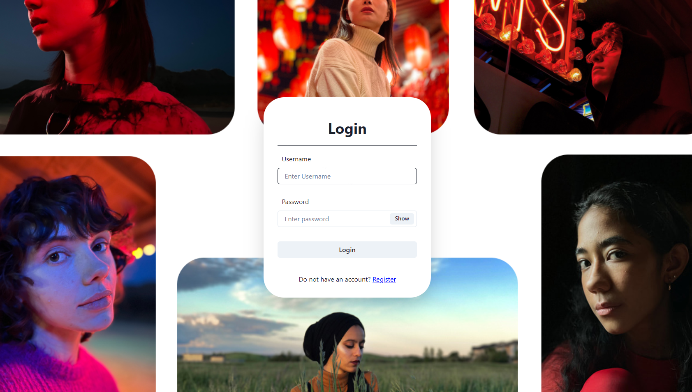
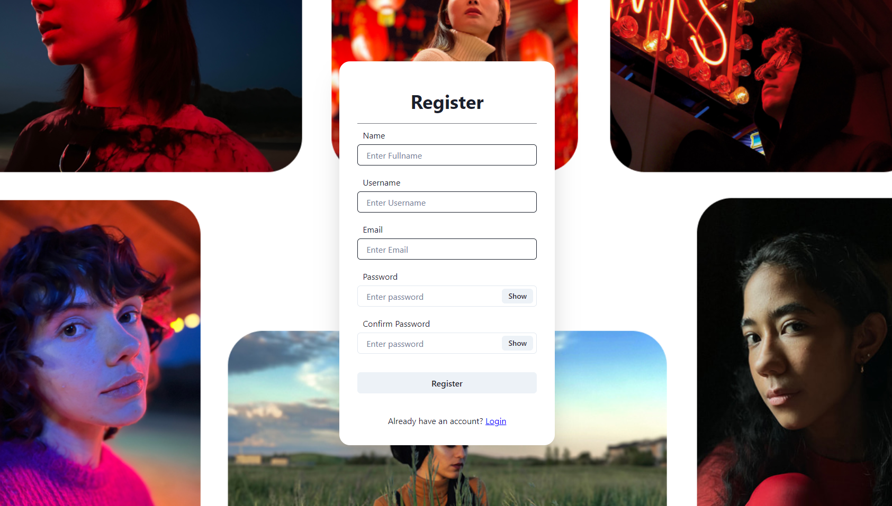
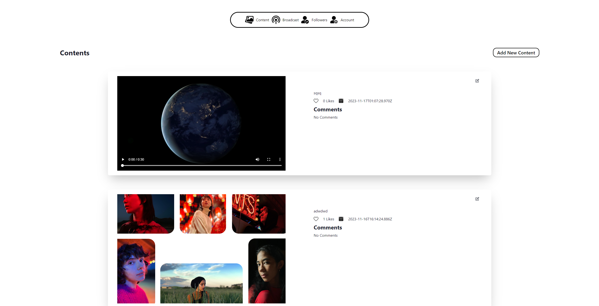
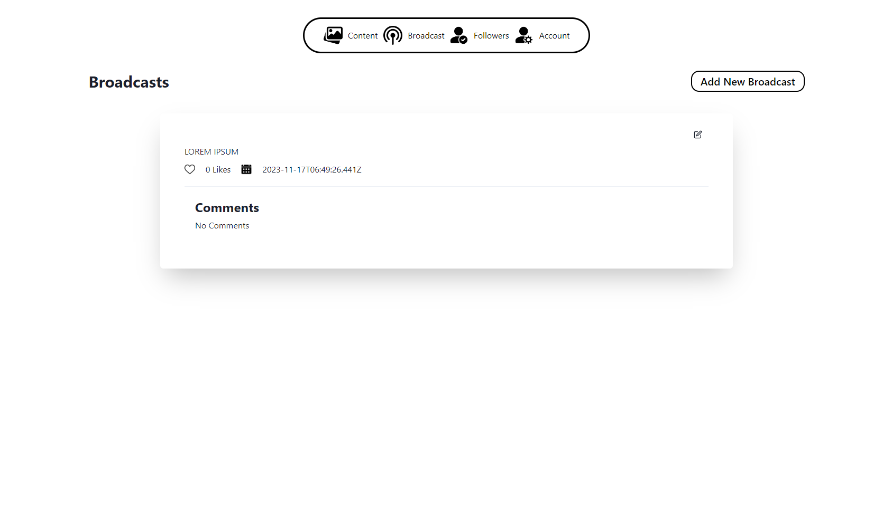
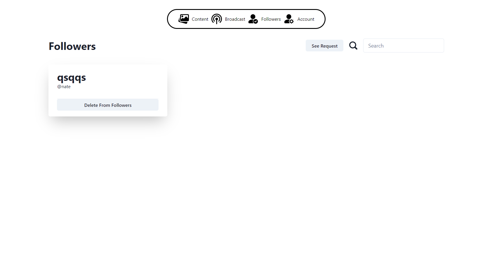
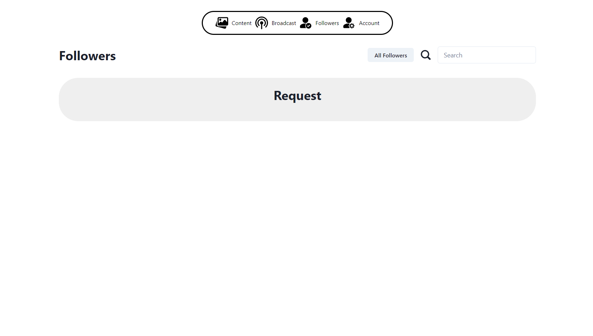
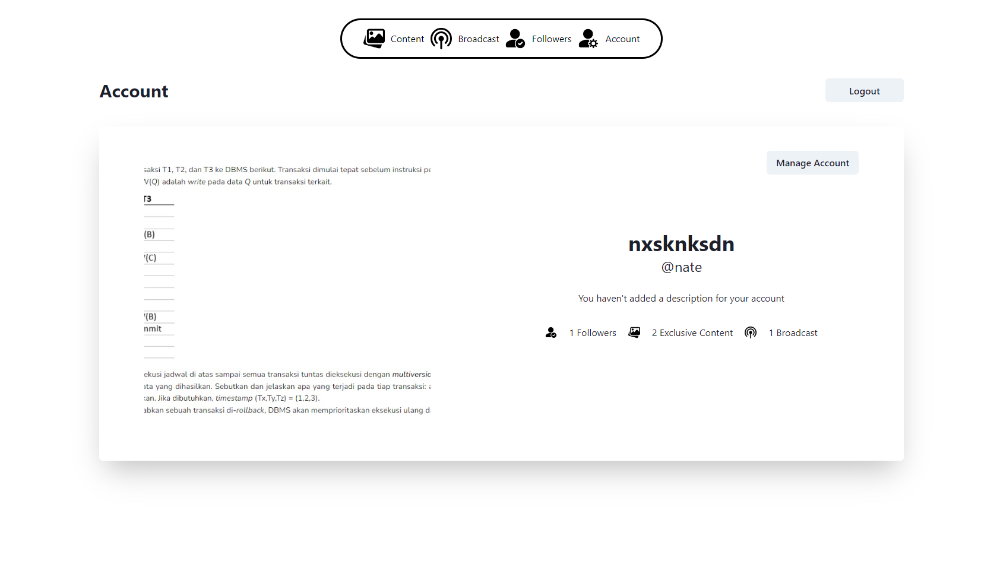
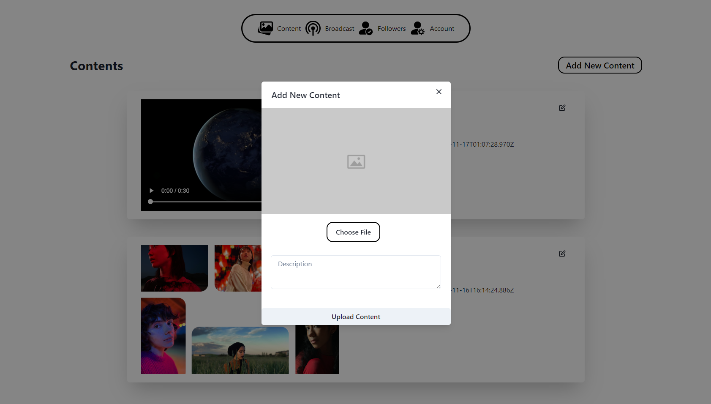

# React + Vite

This template provides a minimal setup to get React working in Vite with HMR and some ESLint rules.

Currently, two official plugins are available:

-   [@vitejs/plugin-react](https://github.com/vitejs/vite-plugin-react/blob/main/packages/plugin-react/README.md) uses [Babel](https://babeljs.io/) for Fast Refresh
-   [@vitejs/plugin-react-swc](https://github.com/vitejs/vite-plugin-react-swc) uses [SWC](https://swc.rs/) for Fast Refresh

# IF3110-2023-02-03
# Spaces - ClientSPA

> Disusun untuk memenuhi Tugas Besar IF3110 Pengembangan Aplikasi Berbasis Web

## Daftar Isi

-   [Deskripsi Aplikasi _Web_](#deskripsi-aplikasi-web)
-   [Tim Pengembang](#tim-pengembang)
-   [Struktur Program](#struktur-program)
-   [Daftar _Requirement_](#daftar-requirement)
-   [Cara Instalasi](#cara-instalasi)
-   [Cara Menjalankan _Server_](#cara-menjalankan-server)
-   [Screenshot Tampilan Aplikasi](#screenshot-tampilan-aplikasi)
-   [Entity Relationship Diagram](#entity-relationship-diagram)
-   [Pembagian Tugas](#pembagian-tugas)

## Deskripsi Aplikasi _Web_

Spaces merupakan aplikasi berbagi konten dari creator. Creator dapat mempublikasikan seluruh karyanya melalui aplikasi ini. Client SPA ini dibangun dengan menggunakan ReactJS dengan Vite. 

## Tim Pengembang

| Nama                   | NIM      | Panggilan |
| ---------------------- | -------- | --------- |
| Mutawally Nawwar | 13521065 | Nawwar    |
| Ghazi Akmal Fauzan          | 13521058 | Ghazi  |
| Antonio Natthan Krishna     | 13521162 | Nate    |
| Ahmad Hapinuddin    | 10023079 | Hapid     |

## Cara Instalasi

1. Lakukan pengunduhan _repository_ ini dengan menggunakan perintah `git clone https://github.com/natthankrish/IF3110-20230103.git` pada terminal komputer Anda.
2. Pastikan komputer Anda telah menginstalasi dan menjalankan aplikasi Docker.
3. Lakukan pembuatan _image_ Docker yang akan digunakan oleh aplikasi ini dengan menjalankan perintah `docker build -t tubes-1:latest .` pada terminal _directory_ aplikasi web.
4. Buatlah sebuah file `.env` yang bersesuaian dengan penggunaan (contoh file tersebut dapat dilihat pada `.env.example`).

## Cara Menjalankan _Server_

1. Anda dapat menjalankan program ini dengan menjalankan perintah `docker-compose up -d` pada terminal _directory_ aplikasi web.
2. Aplikasi web dapat diakses dengan menggunakan browser pada URL `http://localhost:8080/public/home`.
3. Aplikasi web dapat dihentikan dengan menjalankan perintah perintah `docker-compose down` pada terminal _directory_ aplikasi web.

## Screenshot Tampilan Aplikasi

### Login

### Register

### Home

### Content

### Broadcast

### Follower List

### Follower Request

## Manage Account

## Contoh PopUp

## **Requirements**
Browser dan Docker

## BONUS
Docker  
All SPA Responsive Design

## **Pembagian Kerja - Workload Breakdown**

| NIM                | Nama            | Fungsionalitas                    |
| ------------------ | --------------- |------------------------------------------ |
| 13521065           | Nawwar           | Following Request  |
| 13521058           | Ghazi            | User Account Request      |
| 13521162           | Nate             | All Pages, Content and Broadcast Request |

